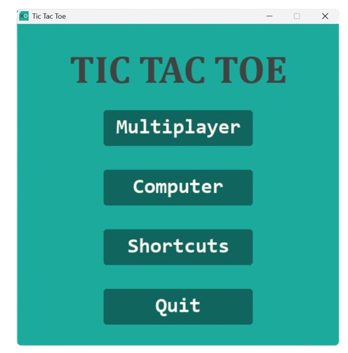
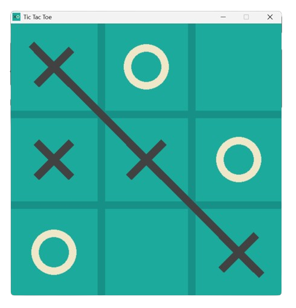
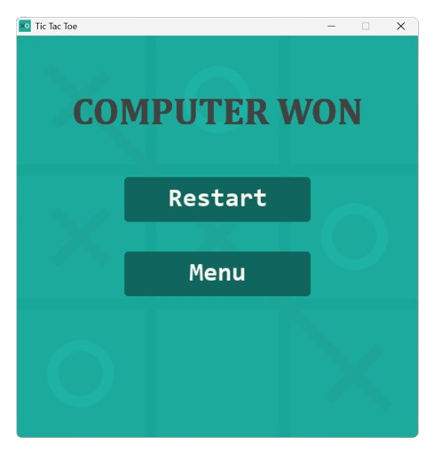

# Tic-Tac-Toe-Game with Unbeatable AI
A desktop implementation of the classic Tic Tac Toe game featuring multiple AI difficulty levels and multiplayer mode, built with Python and Pygame.

## Installation
Click the link to download based on your Operating System.

- [Windows Installer](https://github.com/syedmuneeruddin5/Tic-Tac-Toe-Game/releases/latest/download/Tic-Tac-Toe-Windows-Installer.exe)
- [Mac Installer](https://github.com/syedmuneeruddin5/Tic-Tac-Toe-Game/releases/latest/download/Tic.Tac.Toe.Mac.Installer.dmg)

Here is the link to [Assets](https://github.com/syedmuneeruddin5/Tic-Tac-Toe-Game/releases/latest).

## Screenshots




## Features

- 🎮 **Three AI Difficulty Levels**:
  - Easy: Random moves
  - Medium: Strategic moves with occasional mistakes
  - Hard: Unbeatable AI using minimax algorithm
- 👥 **Multiplayer Mode**: Play against a friend on the same computer
- 🎨 **Clean, Modern UI**: Responsive design with smooth animations
- 🎵 **Sound Effects**: Interactive audio feedback
- 🖱️ **Intuitive Controls**: Simple mouse-based gameplay

## Run from Source
1. Install the required dependencies:
   ```bash
   pip install pygame
   ```
2. Run the game:
   ```bash
   python "Tic Tac Toe.py"
   ```

## Credits:
- Coding Spot tutorial on "Coding an Unbeatable Tic Tac Toe AI Using Python and the Minimax Algorithm".
