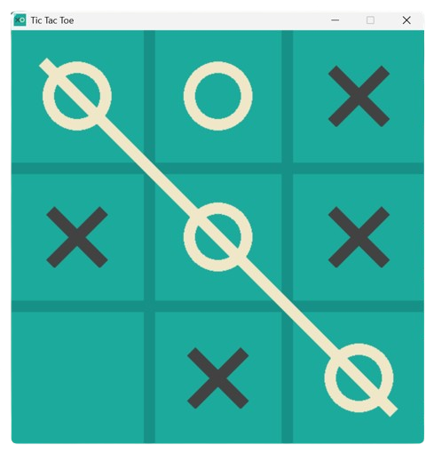

# Tic-Tac-Toe-Game
Tic Tac Toe Game made with pygame having Computer Mode using minimax algorithm

# Installation
Click the link to download based on your Operating System.

- [Windows Installer](https://github.com/syedmuneeruddin5/Tic-Tac-Toe-Game/releases/latest/download/Tic-Tac-Toe-Windows-Installer.exe)
- [Mac Installer](https://github.com/syedmuneeruddin5/Tic-Tac-Toe-Game/releases/latest/download/Tic.Tac.Toe.Mac.Installer.dmg)

Here is the link to [Assets](https://github.com/syedmuneeruddin5/Tic-Tac-Toe-Game/releases/latest).

# Credits:
- Coding Spot tutorial on "Coding an Unbeatable Tic Tac Toe AI Using Python and the Minimax Algorithm".

# Screenshots

